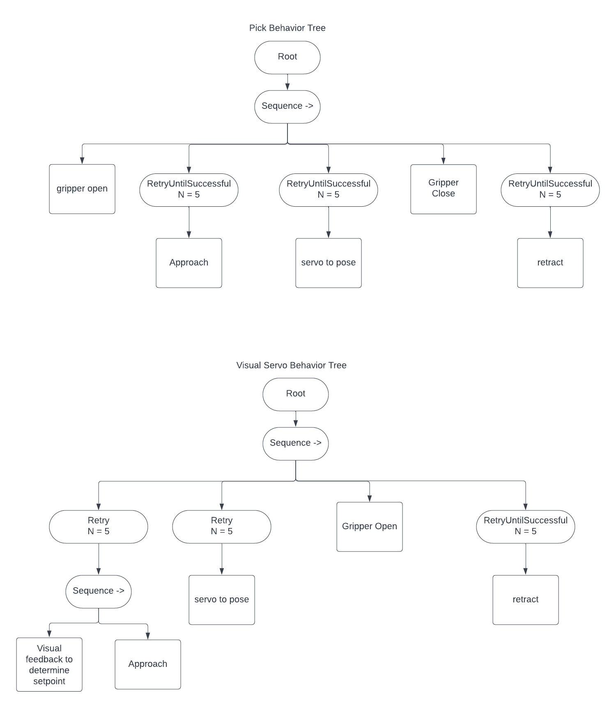
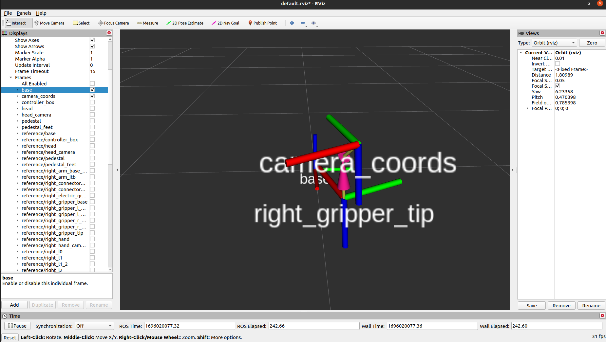
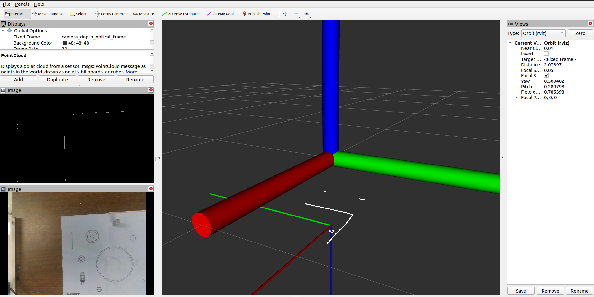

# Pick and Insert Root Cause Analysis using BehaviorTrees and ChatGPT

## Description

Behavior Tree and ROS based tool to do pick and insert like task using a sawyer arm and then debug the same using Natural Language input from a user who observed the experiment happen. The tools used are GPT4, ROS Melodic, BehaviorTrees.CPP. Other libraries are listed below that one needs to install.

## Installation
Install the python libraries using requirements.txt. 

```bash
pip3 install requirements.txt
```

Other C++ and tools level things need to be installed using apt package manager for Ubuntu 20.04. 

```bash
sudo apt-get install ros-noetic-cv-bridge ros-noetic-vision-opencv libboost-all-dev
```
Installing behaviortree.cpp v3 is essential see this [link](https://github.com/BehaviorTree/BehaviorTree.CPP/tree/v3.8) for steps. Prefer Cmake steps as developers may have removed v3 installer when you install it.

The repository assumes sawyer_sdk has been installed and sourced so that all message types and rospy services can be utilised.

## System Design
The software is broken down into a client-server like setup where the server(BTNodeServer.py) and the client(BTClient.cpp). These isolate the robot side development(ik, control and gripper operation) and app/behavior side development(move to point, trajectory definition, complex compound behaviors like pick, see, insert). 

The specific implementation specific details can be seen in the function docstrings for the server node. 

The behaviortree implementation closely follows implementation methods from Behaviortree.cpp. The behavior tree can be broken down as follows: 


#### SubTree Design:



#### Visual feedback functioning

The visual feedback to pick up the object is achieved using a separate node contourPoseFinding.py which finds the pose of the ket when the arm is placed directly above it(in good lighting conditions). The distance between the arm and ket is desired to be 90cms(vertically). 

The algorithm after that can be broken down as:

- Smooth the image using a bilateral filter to remove noise from sharp changes in contrast.
- Convert the RGB image to HSV image, this makes the iron ket(grey) easily detectable on violet mat.
- Find the edges in the image using Canny edge detection
- Find contours in this image to identify the ket.
- If any contour has an area between 320 - 380 (these numbers are unique for the ket but depend on the height at which camera is located) pixels, then ket is detected.
- We fit an ellipse in this particular contour to identify ket. The center of the ellipse is the (x,y) location of the ket. 
- To find the z position, we normalize the depth map spatially.
- The depth map and rgb images are aligned so taking binary and of the image, gives contour's depth projection and thus the ket's base location.
- The pick position is chosen a few cms above the base.
- This pick position is in the camera frame, to get this information in base frame of the robot, we use our camera calibration parameters.
- Camera calibration parameters are loaded from 'src/pick_and_place/src/GripperToCameraTransform.json', then this transform is broadcasted on the /tf topic. 
- The ket to depth camera frame is also broadcasted to the /tf topic thus, completing the tf tree from base to ket. The client code using this can browse the topics independently and do a simple homogeneous matrix multiplication to get the final pose in base location.

#### Hand Eye calibration output
The hand-eye calibration can be achieved using [this](https://github.com/dt1729/hand_eye_calibration.git) repository. This is the author's fork of the main repository and has issues resolved as per libraries available in 2023. 




#### Pick Pose determination output



#### Insert Pose determination method

The insert pose determination requires the apriltag-ros node that detects the pose of the apriltag stuck on the NIST board. This method is the replacement for a forcetorque based method for this sawyer robot. The flow is explained as follows:
- The continuous detection node in apriltag-ros publishes the pose in the /tf topic.
- The servotopose client node in the behaviortree asks the server to servo to tag_118's pose.
- The servo then moves to that pose. (This needs to be modified with a json file that stores poses of goal position with respect to apriltag's center)

The settings.yaml and tags.yaml files in the `./dependencies/apriltag_ros/src/apriltag_ros/config` folder shall be replaced by files with the same names in the dependencies folder.

#### Pick and place with Ket Full

[video](sample_logs/SmallKetPickAndPlace.mp4)


## Description of debugging functionality using GPT4

This piece of software runs after the pick and insert experiment has been completed and observed by a user. The user is now presented with a terminal with GPT4 access preconditioned with the architecture of the behaviortree and access to the code's docstrings and client's node descriptions. Then the user provides the observations and a Q/A type conversation begins. If the system asks questions about success of a node, a kmeans model identifies that and uses an already designed prompt to accomodate the status of that node, along with it's description as given by the programmer. Then this string is appended to the user's response(if they have anything meaningful to add, we do not expect the user to have node level understanding of the run) and passed to the GPT. 

Until now over 5-6 runs this system has shown promise while debugging and more runs are required to get a confirmed usecase for the system along with vision input which is now available.

A few results can be seen here:

#### Test GPT3.5 run

[TestRun](https://chat.openai.com/share/d55a9086-3624-4caa-a764-1f8768433b6d)

Test run locally using chatbot made using Langchain and OpenAI gpt-3.5-turbo can be found in
```src/root_cause_analysis/scripts/experiment1.txt```

#### Steps to run the experiment:
Installing dependencies:
```bash
git clone -r <this-repository>
cd dependencies/
rosdep install --from-paths src --ignore-src -r -y  # Install any missing packages
catkin build    # Build all packages in the workspace (catkin_make_isolated will work also)
source devel/setup.bash
```

```bash
roslaunch realsense2_camera rs_aligned_depth.launch
# Open a new tab
cd dependencies/
source devel/setup.bash
roslaunch apriltag_ros continuous_detection.launch
# Open a new tab
cd ..
catkin build pick_and_place
source devel/setup.bash
rosrun pick_and_place BTNodeServer.py
# Open a new tab
python3 scripts/pickPlacePoseDetermination.py
# When ready to do an experiment, run this command in a new terminal tab
source devel/setup.bash
rosrun pick_and_place pick_and_place
```

To run the user study run the following commands:
```bash
cd <this-repository>
python3 src/root_cause_analysis/scripts/botclass.py
```