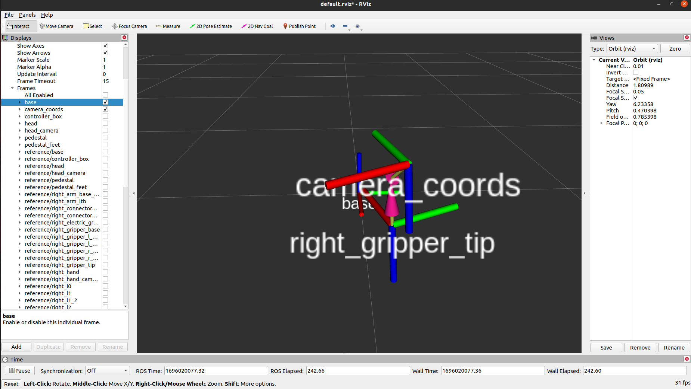
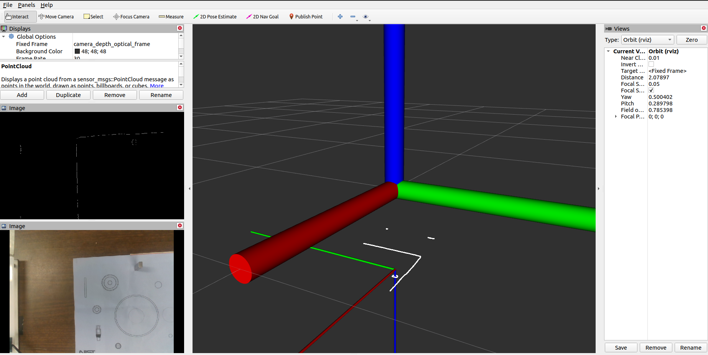
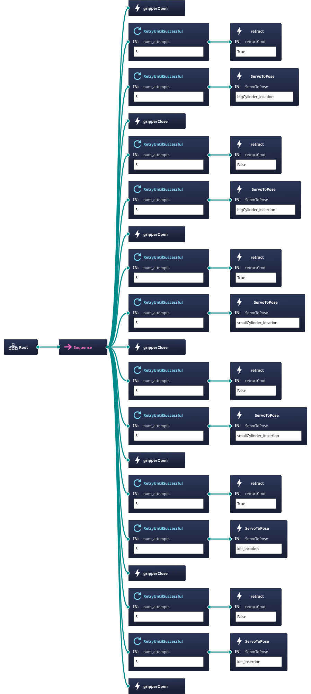

# Pick-and-Insert Robot with Behavior Tree Root Cause Analysis

A ROS-based system for autonomous pick-and-insert manipulation using a Sawyer arm, with a GPT-powered post-experiment debugging tool. The robot picks three objects (ket, big cylinder, small cylinder) from a mat and inserts them into a NIST assembly board. After each run, an LLM chatbot assists a human observer in diagnosing failures.

---

## System Overview

The software has two main subsystems:

1. **Pick-and-Insert Execution** — A BehaviorTree.CPP client (C++) orchestrates the task by calling ROS services exposed by a Python server that wraps the Sawyer hardware API. A separate vision node detects object and insertion poses using depth camera data.

2. **Root Cause Analysis (RCA)** — After the run, a LangChain+GPT chatbot is seeded with the system's code descriptions and ROS logs. It interviews a human observer, identifies which BT node is being discussed using a KMeans classifier, and appends relevant log entries to assist diagnosis.

---

## Hardware

- **Robot arm**: Rethink Sawyer (7-DOF)
- **Gripper**: Rethink electric parallel gripper
- **Camera**: Intel RealSense RGBD (aligned depth + color streams)
- **Assembly board**: NIST board with AprilTag `tag_118` for insertion pose reference

---

## Repository Structure

```
.
├── src/
│   ├── pick_and_place/
│   │   ├── src/
│   │   │   ├── BTClient.cpp              # BehaviorTree.CPP client — task orchestration
│   │   │   └── GripperToCameraTransform.json  # Hand-eye calibration result
│   │   ├── scripts/
│   │   │   └── BTNodeServer.py           # Python ROS service server — hardware interface
│   │   └── srv/                          # ROS service definitions
│   │       ├── approach.srv
│   │       ├── gripper.srv
│   │       ├── retract.srv
│   │       └── servotoPose.srv
│   ├── root_cause_analysis/
│   │   └── scripts/
│   │       ├── textFeedback.py           # GPT-based RCA chatbot (text)
│   │       ├── visionFeedback.py         # RCA chatbot with DINOv2 segmentation (experimental)
│   │       ├── visionFeedbackSAM.py      # RCA chatbot with SAM-PT tracking (in progress)
│   │       ├── classificationTraining_adav2.pkl   # KMeans training embeddings
│   │       ├── QuestionClassificationModel.pkl    # Trained KMeans model
│   │       └── ClassificationLabels.json          # Cluster-to-node label mapping
│   └── jsoncpp/                          # jsoncpp library (built locally)
├── scripts/
│   ├── pickPlacePoseDetermination.py     # Vision node — ket detection and TF broadcasting
│   ├── inference_node.py                 # YOLOv7 inference for NIST board hole detection
│   ├── FaultIsolation.py                 # Particle filter for fault isolation (stub)
│   ├── handEyeTransformPub.py            # Publishes hand-eye calibration transform
│   ├── enpoint_state_publisher.py        # Publishes Sawyer endpoint state
│   └── good_calibration_results/         # Stored hand-eye calibration output files
├── transforms/
│   ├── referencePickLocations.json       # (x,y) offsets of each object relative to ket center
│   └── referenceInsertLocations.json     # (x,y,z) offsets of each insertion hole relative to tag_118
├── treedefs/
│   └── basic_tree.xml                    # Prototype BT with probability-tracking nodes
├── launch/
│   ├── pick_and_place_server.launch      # Launches BTNodeServer.py
│   └── pick_and_place_client.launch      # Launches the compiled BTClient binary
└── dependencies/                         # apriltag_ros and other ROS dependencies
```

---

## Pick-and-Insert Execution

### Client: `BTClient.cpp`

The C++ client uses BehaviorTree.CPP v3 to sequence the task. It defines the following action nodes:

| Node | Description |
|------|-------------|
| `gripperOpen` | Calls `GripperCmd` service with command `"Open"` |
| `gripperClose` | Calls `GripperCmd` service with command `"Close"` |
| `approach` | Calls `ApproachCmd` with a pose read from the BT blackboard |
| `ServoToPose` | Calls `ServoToPoseCmd` with a TF frame name; server looks up the pose at runtime |
| `retract` | Calls `RetractCmd`; `True` → position over the mat, `False` → position over NIST board |
| `visualFeedback` | Subscribes to `/visionFeedback/MeanValue`, transforms pose from camera to gripper frame, writes it to the blackboard |

The active tree (`finalBehaviorTree`) executes the full three-object sequence: pick bigCylinder → insert → pick smallCylinder → insert → pick ket → insert. Each motion step is wrapped in `RetryUntilSuccessful` with 5 attempts.

### Server: `BTNodeServer.py`

A Python ROS node that wraps the Rethink `intera_interface` API and exposes four services:

| Service | Handler | Behavior |
|---------|---------|----------|
| `GripperCmd` | `gripper_srv` | Opens or closes the gripper |
| `ApproachCmd` | `_approach` | IK to a hover pose `hover_distance` above the target |
| `ServoToPoseCmd` | `_servo_to_pose` | Looks up a named TF frame, computes IK, and moves to it |
| `RetractCmd` | `_retract` | Moves to one of two hardcoded safe joint configurations |

### Vision Node: `pickPlacePoseDetermination.py`

Detects the ket and computes pick/insert poses, broadcasting them as named TF frames that `ServoToPose` can look up.

**Pick pose detection pipeline:**
1. Bilateral filter to smooth the RGB image
2. Convert to HSV and threshold to isolate the grey ket on the violet mat
3. Canny edge detection → contour finding
4. Filter contours by area (320–380 px²) to isolate the ket at 90 cm camera height
5. Fit an ellipse to the contour; its center gives the (x, y) pixel location
6. Back-project to 3D using the aligned depth image and Open3D intrinsics
7. Compute bigCylinder and smallCylinder positions using fixed offsets from `transforms/referencePickLocations.json`
8. Broadcast TF frames: `ket_location`, `bigCylinder_location`, `smallCylinder_location`

**Insert pose detection:**
- AprilTag `tag_118` on the NIST board is detected by the `apriltag_ros` continuous detection node
- Fixed offsets from `transforms/referenceInsertLocations.json` are applied to compute per-object insertion poses
- Broadcast TF frames: `ket_insertion`, `bigCylinder_insertion`, `smallCylinder_insertion`

**Hand-eye calibration** (`GripperToCameraTransform.json`) relates the gripper tip frame to the camera frame and is used when transforming detected poses. The calibration was performed using [this fork](https://github.com/dt1729/hand_eye_calibration.git) of the hand-eye calibration repository.

---

## Root Cause Analysis

After the experiment, run `textFeedback.py` to start a GPT-4 assisted debugging session.

### How it works

1. **Context loading**: Parses docstrings from `BTNodeServer.py` and C++ doc-comments from `BTClient.cpp` to build a description of every node and service.
2. **Log loading**: Parses `~/.ros/log/CommandServer.log` into a structured DataFrame keyed by node name and severity.
3. **Initial prompt**: Seeds a LangChain `ConversationChain` with the system architecture, code descriptions, and the behavior tree XML. GPT takes the role of a debugging assistant.
4. **Conversation loop**: The human observer describes what they saw. On each GPT reply:
   - A **KMeans classifier** (trained on GPT-3.5 embeddings of 20 template questions per BT node) identifies which node the AI is asking about.
   - If a node is identified, its log entries are prepended to the user's next message so GPT has the actual runtime data.
5. **Completion**: Typing `ANALYSIS COMPLETE` ends the loop, saves the conversation transcript, and archives the log file.

### Training the classifier

The KMeans model is pre-trained and stored in `QuestionClassificationModel.pkl`. To retrain it on a different behavior tree, call `training_classifier()` in `textFeedback.py`, which generates 20 questions per node using GPT-3.5, embeds them with `text-embedding-ada-002`, and fits a new KMeans model.

---

## Installation

**Python dependencies:**
```bash
pip3 install -r requirements.txt
```

**System dependencies (Ubuntu 20.04):**
```bash
sudo apt-get install ros-noetic-cv-bridge ros-noetic-vision-opencv libboost-all-dev
```

**BehaviorTree.CPP v3:**
Install from the [v3.8 branch](https://github.com/BehaviorTree/BehaviorTree.CPP/tree/v3.8) using CMake. The v3 installer may have been removed by the time you read this, so prefer the CMake build steps.

**jsoncpp:**
Build from `src/jsoncpp/` following the instructions in that directory.

**Sawyer SDK:**
The repository assumes `sawyer_sdk` (Intera SDK) is installed and sourced so that all message types and `rospy` services are available.

**ROS dependencies:**
```bash
cd dependencies/
rosdep install --from-paths src --ignore-src -r -y
catkin build
source devel/setup.bash
```

---

## Running the System

Open separate terminals for each step:

```bash
# 1. Start the RealSense camera
roslaunch realsense2_camera rs_aligned_depth.launch

# 2. Start AprilTag detection
cd dependencies/ && source devel/setup.bash
roslaunch apriltag_ros continuous_detection.launch

# 3. Start the vision node (pick/insert pose detection)
python3 scripts/pickPlacePoseDetermination.py

# 4. Start the behavior tree server
source devel/setup.bash
rosrun pick_and_place BTNodeServer.py

# 5. Build and run the behavior tree client
catkin build pick_and_place
source devel/setup.bash
rosrun pick_and_place pick_and_place
```

### Running the RCA chatbot

After the experiment is complete:
```bash
cd <repository-root>
python3 src/root_cause_analysis/scripts/textFeedback.py
```

Set your OpenAI API key before running:
```bash
export OPENAI_API_KEY=<your-key>
```

---

## Results

**Hand-eye calibration output:**

<p align="center">
  
</p>

**Pick pose determination output:**

<p align="center">
  
</p>

**Behavior tree subtree design:**

<p align="center">
  
</p>

**Full pick-and-place run (ket):**

[SmallKetPickAndPlace.mp4](sample_logs/SmallKetPickAndPlace.mp4)

**RCA chatbot test run (GPT-3.5):**

[View conversation](https://chat.openai.com/share/d55a9086-3624-4caa-a764-1f8768433b6d)

Local experiment transcript: `src/root_cause_analysis/scripts/experiment1.txt`
